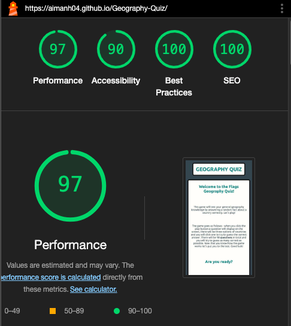

# GEOGRAPHY QUIZ

Welcome to my [Geography Quiz](https://aimanh04.github.io/Geography-Quiz/)

This project is a web-based quiz game quiz to test your general geography knowledge. This web-based quiz application displays a series of general questions about a random country to put the user to the test to see how much they know and how many they can answer correctly.

## Table of Contents

- [User Stories](#user-stories)
- [Website Design](#website-design)
- [Gameplay Breakdown](#gameplay-breakdown)
- [Technologies Used](#technologies-used)
- [Testing](#testing)
- [Deployment](#deployment)
- [Credits](#credits)

## User Stories

### First Time User Stories

* As a user, I want to be able to test my general knowledge on different world countries with fun and interesting facts about different countries.

* As a user, I want to fully understand the website, the structure and the quiz. I want the quiz to be easy to use and navigate.

* As a user, I want the website to be able to give me immediate feedback to see whether my answers was correct or incorrect and I can learn something new about the certain country if I happen to answer incorrectly.

* As a user, I want to make sure that the website is fully responsive so it can be used on all types of devices whether that's a phone, tablet or larger screens like a laptop. This also means assuring that the layout of the website transitions and adjust smoothly on all devices.

## Website Design
### Color Scheme

The main colors of the website consists of the first three colors on the palette which is Charcoal, teal and white. Other minor colors were also used like oxford blue for the next button, green and red for the score counter.

Colors palette created by [coolors](https://coolors.co/) website.

### Typography
[Google fonts](https://fonts.google.com/) was used to import the chosen font to the wbesite.
The font I chose for my website is:
- Ubuntu

### Header

- The header displays the title for the game, informing users what the website is called.
- The header remains in a fixed position throughout the game.

### Main

- This main section is the most important part of the webpage because it holds the game container.
- Inside this section contains a welcome message, explains to the user how the game goes and has a play button to redirect you to the game.

### Footer

- The footer contains a minimal design with a button that will redirect you to the homepage.

## Gameplay Breakdown

### Testing the website

| Features | Test steps | Expected Outcome | Result |
|-----    |----------    |----------   |------|
| Loading of the page |1. Open the website with its URL. 2. Take note of the elements presented on the page.| The header, main section, and the button PLAY are displayed correctly. | Pass |
| Play Button Onclick | 1. Click the 'Play' button. 2. Observe the changes on the screen.| The main section of the starting page is hidden and transitions to the gameplay. The first question and answer buttons appear, the scoring area becomes visible, and the 'Play Again' button displays correctly after the game is completed. | Pass |
| Answer Buttons Onclick | 1. Click on one of the answer buttons. 2. Take note of the score area and buttons.| Score area updates with correct or incorrect answer count. Answer buttons turn green or red depending on whether you answered correctly or not. After that next button shows up to redirect you to the next question with possible answers. The Play Again button appears when you complete the quiz. | Pass |
| Quiz completed | 1. Answer all questions in the game. 2. Observe the final screen.| The gameplay section and questions gets hidden, and a score result message with score details appears. Under the section, the Play Again button appears.| Pass |
| Play Again Button Onclick | 1. Click the ’Play Again’ button at the end of quiz. 2. Observe the transition back to the quiz. |At the end of the quiz the next button will turn into play again button. When you click the play again button you will be redirected to the game.| Pass |

### Further explanation

1. Loading of the page
- Open the website [Geography Quiz](https://aimanh04.github.io/Geography-Quiz/).
- Expect that the header, main section and the play button is displayed.
- Status: Passed

2. Play Onclick
- Click the play button and watch how it redirects you to the gameplay.
- Expect the main section of the home page hidden and transition to the game.
- Status: Passed

3. Answer Buttons Onclick
- Click on one of the answer buttons and take note of the change on the webpage.
- Expect the score area to update and the button will either turn green or red whether you chose the correct or incorrect answer and observe the Next button appearing to redirct you to the next question.
- Status: Passed

4. Quiz completed
- Answer all questions in the game and observe the final score screen.
- Expect the gameplay and questions get hidden and score result message with score details and Play again button appears.
- Status: Passed

5. Play again button Onclick
- Click the play again button at the end of the game.
- Expect that you will be redirected back to the game after clicking the play again button.
- Status: Passed

## Technologies Used

### Languages

- HTML 
- CSS
- JavaScript

### Frameworks, Libraries and Programes used

- [GitHub](https://GitHub.com/) - To save and store files for the website
- [Gitpod](https://gitpod.io/) - To use as workspace to code website
- [Google Fonts](https://fonts.google.com/) - To import fonts into website
- [Chrome Dev Tools](https://developers.google.com/web/tools/chrome-devtools) - Used to troubleshoot, test the sites responsiveness, check the page's elements and style elements
- [PNG arts](https://www.pngarts.com/?s=globe+) - Used for the wbesites favicon
- [Chrome Lighthouse](https://developers.google.com/web/tools/lighthouse) - To test the websites performance and accesibility
- [Am I Responsive](https://ui.dev/amiresponsive) - Used to test responsivness
- [Image Resizer](https://imageresizer.com/crop-image/editor) - Used to resize images for this README.
- [Coolors](https://coolors.co/) - Used to create color palette.

## Testing

### Validator Testing
#### HTML
No errors were found on the webpage quiz when testing it with the W3C Markup Validator.

- [Geography Quiz W3C HTML Validator results](https://validator.w3.org/nu/?doc=https%3A%2F%2Faimanh04.github.io%2FGeography-Quiz%2F)

#### CSS
No errors were found for the CSS Stylesheet from the W3C CSS Validator.

- [CSS W3C Jigsaw Stylesheet Validator results](https://jigsaw.w3.org/css-validator/validator?uri=https%3A%2F%2Faimanh04.github.io%2FGeography-Quiz%2F&profile=css3svg&usermedium=all&warning=1&vextwarning=&lang=sv)

#### JavaScript
No errors were found on the JSHint tester.

### Manual Testing

Website has been tested on:

- Google Chrome
- Mozilla Firefox
- Safari
- Macbook Air
- Iphone 12 Pro
- Samsung Galaxy s20

### Lighthouse Testing
The chrome extension lighthouse was used to test the website performance and accesibility. Here are the results:

#### Desktop

#### Mobile

### Unfixed bugs

- No known bugs has been left unfixed

## Deployment

### Deployment Steps
The website has been deployed to GitHub. Here were the steps as followed to deploy:
1. Log in to [GitHub](https://github.com/).
2. In your GitHub repository, navigate to the settings tab.
3. Select "Pages" on the Codes and automation section on the left-hand sidebar.
4. Select the following:
- The source is set to "Deploy from branch"
- Main branch shall be selected
- Folder is set to / (root).
5. Click save next to /root.
6. Go back to the code tab. Refresh your repository and a deployment section will show up with your deployed project.

### Forking the Github Repository
The steps to fork the github repository are:
1. Log in to your [GitHub](https://github.com/).
2. Go to the repository for Geography Quiz.
3. Click fork on the right hand side of the screen.

### Making a local clone
To clone this repository, do the following steps:
1. Log in to your [GitHub](https://github.com/).
2. Go to the repository for this project [Geography Quiz](https://github.com/aimanh04/Geography-Quiz/tree/main).
3. Click on the code button and select whether you would like to clone with HTTPS, SSH or GitHub CLI and then copy the URL to your clipboard.
4. Open the terminal in your selected code editor and change the current working directory to the location of where you want the cloned directory.
5. Type "git clone" into the terminal, paste the link you copied and press enter.

The live link to the website is here - [Geography Quiz](https://aimanh04.github.io/Geography-Quiz/)

## Credits

### Special Thanks To

- Code Institutes learning material from the diploma-educations and the essentials on HTML, CSS and JavaScript. Especially the Love Running walkthrough project.

- [Make Quiz Youtube Tutorial by GreatStack](https://www.youtube.com/watch?v=PBcqGxrr9g8&t=14s) - This video was extremely helpful for me to understand the structure of a quiz game and I relied heavily on the Youtube video made by GreatStack.

- [ChatGPT](https://chatgpt.com/) - Used to create texts and paragraphs on my website when I lacked creativity.

- [W3CSchools](https://www.w3schools.com/)

- [Stack Overflow](https://stackoverflow.com/)

- [MDN](https://developer.mozilla.org/en-US/)
