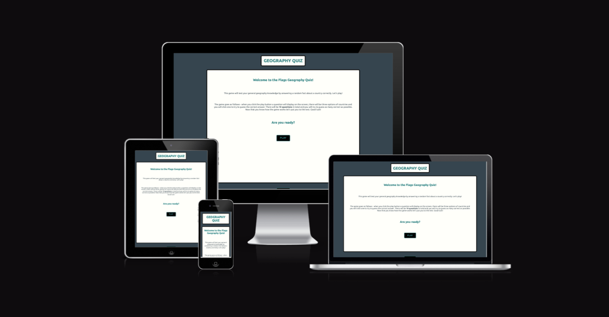

# GEOGRAPHY QUIZ

Welcome to my [Geography Quiz](https://aimanh04.github.io/Geography-Quiz/)

This project is a web-based quiz game quiz to test your general geography knowledge. This web-based quiz application displays a series of general questions about a random country to put the user to the test to see how much they know and how many they can answer correctly.

## Table of Contents

## User Stories

### First Time User Stories

* As a user, I want to be able to test my general knowledge on different world countries with fun and interesting facts about different countries.

* As a user, I want to fully understand the website, the structure and the quiz. I want the quiz to be easy to use and navigate.

* As a user, I want the website to be able to give me immediate feedback to see whether my answers was correct or incorrect and I can learn something new about the certain country if I happen to answer incorrectly.

* As a user, I want to make sure that the website is fully responsive so it can be used on all types of devices whether that's a phone, tablet or larger screens like a laptop. This also means assuring that the layout of the website transitions and adjust smoothly on all devices.

## Website Design
### Color Scheme

The main colors of the website consists of the first three colors on the palette which is Charcoal, teal and white. Other minor colors were also used like oxford blue for the next button, green and red for the score counter.

Colors palette created by [coolors](https://coolors.co/) website.

### Typography
[Google fonts](https://fonts.google.com/) was used to import the chosen font to the wbesite.
The font I chose for my website is:
- Ubuntu

### Header

- The header displays the title for the game, informing users what the website is called.
- The header remains in a fixed position throughout the game.

### Main

- This main section is the most important part of the webpage because it holds the game container.
- Inside this section contains a welcome message, explains to the user how the game goes and has a play button to redirect you to the game.

### Footer

- The footer contains a minimal design with a button that will redirect you to the homepage.

## Gameplay Breakdown

## Technologies Used

## Testing

## Deployment

The website has been deployed to GitHub. Here were the steps as followed to deploy:
1. Log in to GitHub.
2. In your GitHub repository, navigate to the settings tab.
3. Select "Pages" on the Codes and automation section on the left-hand sidebar.
4. Select the following:
- The source is set to "Deploy from branch"
- Main branch shall be selected
- Folder is set to / (root).
5. Click save next to /root.
6. Go back to the code tab. Refresh your repository and a deployment section will show up with your deployed project.

The live link to the website is here - [Geography Quiz](https://aimanh04.github.io/Geography-Quiz/)

## Credits
